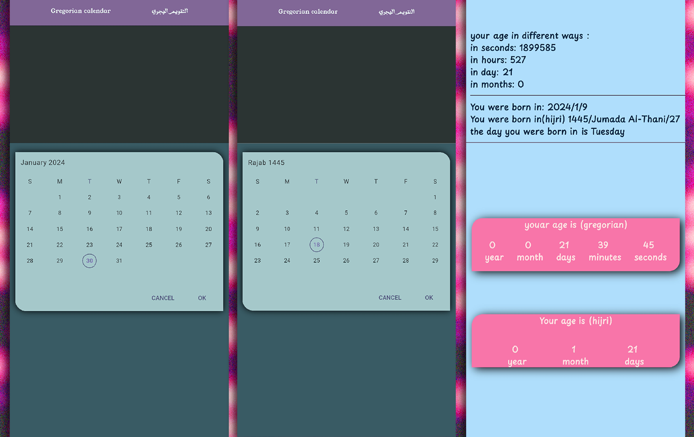

<h1>simple flutter app to count your age in Gregorian and Hijri date</h1>
<h3>here are some images from the app</h3>

<h3>you can try it yourself by clicking <a href="https://media.githubusercontent.com/media/abdulwahed-s/age-calculator-app/master/age-calculator.apk?download=true">HERE</a></h3>
